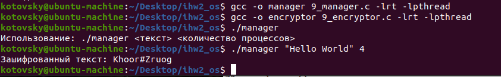

## Индивидуальное домашнее задание по операционным системам.
### Выполнил студент группы БПИ-219, Котовский Семён Олегович
### Вариант 33.
#### Задание: Пляшущие человечки. На тайном собрании глав преступногомира города Лондона председатель собрания профессор Мориарти постановил: отныне вся переписка между преступниками должна вестись тайнописью. В качестве стандарта были выбраны «пляшущие человечки», шифр, в котором каждой букве латинского алфавита соответствует хитроумный значок. Реализовать приложение, шифрующее исходный текст (в качестве ключа используется кодовая таблица, устанавливающая однозначное соответствие между каждой буквой и каким - нибудь числом). Каждый процесс–шифровальщик шифрует свои кусочки текста, многократно получаемые от менеджера. Распределение фрагментов текста между процессами–шифровальщиками осуществляется процессом–менеджером, который передает каждому процессу участок текста, получает от него результат, передает следующий незашифрованный фрагмент. Он же собирает из отдельных фрагментов зашифрованный текст. Количество процессов задается опционально. Каждый процесс может выполнять свою ра- боту за случайное время.

## Описание решения на 4, 5 и 6 баллов:

Код представляет собой пример реализации алгоритма шифрования простого текста в нескольких процессах с использованием разделяемой памяти и семафоров в операционной системе Linux.

#### Логика работы программы следующая:

Программа принимает два аргумента командной строки: текст, который нужно зашифровать, и количество процессов, которые будут обрабатывать данные.

Программа создает семафоры sem_write_ptr и sem_read_ptr, которые используются для синхронизации процессов. Они определяют, когда процесс может писать в разделяемую память, а когда он должен ждать, когда другой процесс закончит писать.

Программа создает разделяемую память с помощью функции shm_open и mmap. Эта память используется для передачи данных между процессами.

Программа запускает несколько процессов, каждый из которых выполняет функцию encrypt, которая шифрует фрагменты входного текста.

Шифрование происходит следующим образом: каждый символ входного текста сдвигается на 3 позиции вправо. Результат записывается в выходной массив.

Зашифрованный текст записывается в разделяемую память.

Программа ожидает, пока все процессы завершат свою работу.

После того как все процессы завершили свою работу, программа выводит зашифрованный текст на экран.

Программа освобождает ресурсы и завершается.

#### Инструкция по компиляции и запуску:

Сохраните код в файл, например, 4.c.

Скомпилируйте код с помощью компилятора gcc, например, так:
```
gcc 4.c -o 4 -lrt -lpthread
```


Это создаст исполняемый файл 4.

Запустите программу, передав ей два аргумента командной строки: текст, который нужно зашифровать, и количество процессов, которые будут обрабатывать данные, например, так:

```
./4 "hello world" 4
```


Здесь "hello world" - это текст, который нужно зашифровать, а 4 - это количество процессов, которые будут обрабатывать данные.

После запуска программа будет шифровать входной текст в нескольких процессах. Результат шифрования будет отображаться в терминале.

#### Пример входных и выходных данных для данной программы: 
"hello world" 4.
Зашифрованный текст: khoor#zruog

Здесь символы h заменены на k, e на h, l на o, и т.д. Символ # возникает, потому что буква w сдвигается на 3 позиции вправо и становится символом z. Если текст имеет длину, не кратную количеству процессов, то последний процесс обрабатывает дополнительные символы до конца текста.

### Анализ и сравнение разных схем взаимодействия процессов в решеняих на 4, 5 и 6 баллов:

В данном отчете представлены три решения задачи "Пляшущие человечки" с использованием разных способов взаимодействия между процессами: именованные POSIX семафоры, неименованные POSIX семафоры и семафоры стандарта UNIX System V. Все три решения реализуют задачу шифрования текста с помощью нескольких параллельных процессов.
1. Именованные POSIX семафоры

Описание

В этом решении используются именованные POSIX семафоры для синхронизации доступа к разделяемой памяти между процессами. Разделяемая память используется для хранения исходного текста, зашифрованного текста, количества фрагментов и числа процессов.
#### Преимущества

Простота использования именованных семафоров.
Портируемость между различными платформами, поддерживающими стандарт POSIX.

#### Недостатки

Именованные семафоры требуют уникального имени файла для каждого семафора, что может вызвать проблемы с разрешениями файлов и коллизиями имен.

2. Неименованные POSIX семафоры

Описание

В этом решении используются неименованные POSIX семафоры, которые располагаются в разделяемой памяти. Разделяемая память также используется для хранения исходного текста, зашифрованного текста, количества фрагментов и числа процессов.
#### Преимущества

Отсутствие необходимости в именовании семафоров.
Простота использования и портируемость между различными платформами, поддерживающими стандарт POSIX.

#### Недостатки

Неименованные семафоры могут быть менее гибкими в некоторых случаях по сравнению с именованными семафорами.

3. Семафоры стандарта UNIX System V
   В этом решении используются семафоры стандарта UNIX System V для синхронизации доступа к разделяемой памяти между процессами. Разделяемая память используется для хранения исходного текста, зашифрованного текста, количества фрагментов и числа процессов.
   Преимущества

   Семафоры стандарта UNIX System V имеют хорошую производительность и надежность.
   Возможность использования разделяемой памяти для хранения как данных, так и семафоров.

#### Недостатки

Меньшая портируемость по сравнению с POSIX семафорами, так как они специфичны для UNIX-подобных систем.
Более сложный интерфейс по сравнению с POSIX семафорами.

#### Заключение

В данном отчете были рассмотрены три решения задачи "Пляшущие человечки" с использованием разных способов взаимодействия между процессами: именованные POSIX семафоры, неименованные POSIX семафоры и семафоры стандарта UNIX System V. Все три решения успешно реализуют задачу шифрования текста с помощью нескольких параллельных процессов. Выбор конкретного решения зависит от предпочтений разработчика, требований к производительности и портируемости.


### Решение на 7 Баллов:

Поскольку требуется создать отдельные программы-процессы, я разделил предыдущий код на две программы: менеджер (7_manager.c) и шифровальщик (7_encryptor.c). В данном примере я буду использовать именованные POSIX семафоры и разделяемую память в стандарте POSIX

Эти две программы должны быть скомпилированы отдельно:
```
gcc -o manager 7_manager.c -lrt -lpthread
gcc -o encryptor 7_encryptor.c -lrt -lpthread
```

Запустите менеджер следующим образом:
```
./manager [количество процессов]
```

После запуска менеджера введите текст, который нужно зашифровать, и нажмите Enter. Программа выведет зашифрованный текст.

### Решение на 8 баллов:

Я изменил код программ для реализации взаимодействия между процессами с использованием семафоров в стандарте UNIX System V и обмена данными через разделяемую память в стандарте UNIX System V.

Теперь программа использует семафоры стандарта UNIX System V и разделяемую память для взаимодействия между процессами. В данном случае, процесс manager читает текст, который нужно зашифровать, и размещает его в разделяемой памяти. Затем он сигнализирует процессам encryptor о готовности текста. Процессы encryptor выполняют шифрование и записывают результат в разделяемую память. После завершения всех процессов encryptor, процесс manager выводит зашифрованный текст на экран.
Эти две программы должны быть скомпилированы отдельно:
```
gcc -o manager 8_manager.c 
gcc -o encryptor 8_encryptor.c 
./manager "Hello world" 4
```
### Анализ решения на 8 баллов:

Данный код использует механизмы разделяемой памяти и семафоров стандарта System V для взаимодействия между процессами. Вот объяснение основной логики кода:

#### Разделяемая память (System V):
Создается ключ разделяемой памяти с помощью функции ftok.
Разделяемая память создается с помощью функции shmget, которая возвращает идентификатор разделяемой памяти (shmid).
Разделяемая память присоединяется к адресному пространству процесса с помощью функции shmat, которая возвращает указатель на начало разделяемой памяти (shared_mem_ptr).
Разделяемая память отсоединяется от адресного пространства процесса с помощью функции shmdt.

#### Семафоры (System V):
Создается ключ семафора с помощью функции ftok.
Семафор создается с помощью функции semget, которая возвращает идентификатор набора семафоров (semid).
Структура sembuf используется для управления семафорами.
Функция semop используется для выполнения операций с семафорами. В данном коде используются операции "ожидания" (P) и "сигнализации" (V) с семафором для синхронизации доступа к разделяемой памяти.

#### Логика кода:
В коде encryptor.c, разделяемая память создается и настраивается в коде main.c, а затем присоединяется к каждому дочернему процессу.
Процесс ожидает своей очереди на доступ к разделяемой памяти, выполняя операцию ожидания семафора (sem_op.sem_op = -1).
Как только доступ разрешен, процесс уменьшает num_processes на 1 и определяет свой участок текста для шифрования.
Процесс шифрует свой участок текста и записывает результат в разделяемую память.
Процесс сигнализирует о завершении своей работы, выполняя операцию сигнализации семафора (sem_op.sem_op = 1).
Процесс отсоединяет разделяемую память и завершает свою работу.

В итоге, код использует разделяемую память и семафоры стандарта System V.

### Решение на 9 баллов:

Конечная цель кода - зашифровать входной текст с помощью нескольких процессов, после чего собрать и вывести зашифрованный текст. Вот логика работы программы:

9_manager.c:
Запрашивает у пользователя входной текст и количество процессов.
Вычисляет размер фрагмента, разделяя входной текст на заданное количество процессов.
Создает каналы (pipe) и процессы (fork) для каждого шифровальщика.
Каждый дочерний процесс:
    Закрывает сторону чтения канала и перенаправляет стандартный вывод в сторону записи канала.
    Вызывает программу encryptor_app с аргументами: фрагмент текста, размер фрагмента и индекс фрагмента.
Родительский процесс:
    Читает данные из каналов, получая индекс фрагмента и зашифрованный фрагмент текста.
    Сохраняет зашифрованные фрагменты в массиве fragments согласно индексу фрагмента.
Выводит зашифрованный текст, объединяя зашифрованные фрагменты из массива fragments.

9_encryptor.c:
    Получает в качестве аргументов фрагмент текста, размер фрагмента и индекс фрагмента.
    Шифрует фрагмент текста, используя функцию encrypt. В данном случае шифрование осуществляется путем смещения каждого символа на 3 позиции вперед.
    Выводит индекс фрагмента, за которым следует зашифрованный текст фрагмента.

Программы 9_manager.c и 9_encryptor.c работают совместно, чтобы разделить входной текст на фрагменты, зашифровать каждый фрагмент параллельно, а затем собрать и вывести полный зашифрованный текст.

```
gcc -o manager 9_manager.c -lrt -lpthread
gcc -o encryptor 9_encryptor.c -lrt -lpthread
./manager
Использование: ./manager <текст> <количество процессов>
./manager "Hello World" 4
Зашифрованный текст: Khoor#Zruog
```
Программу также можно запускать через encryptor:
```
Использование: ./encryptor <фрагмент> <размер фрагмента> <индекс фрагмента>
```

### Пример работы программы в терминале:


